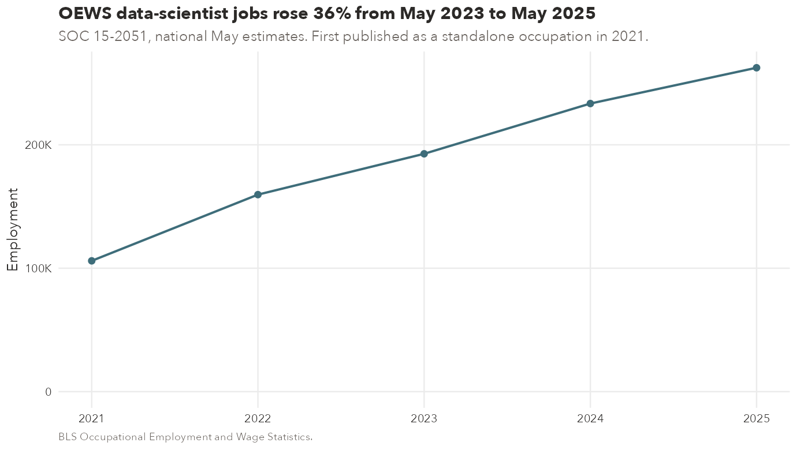
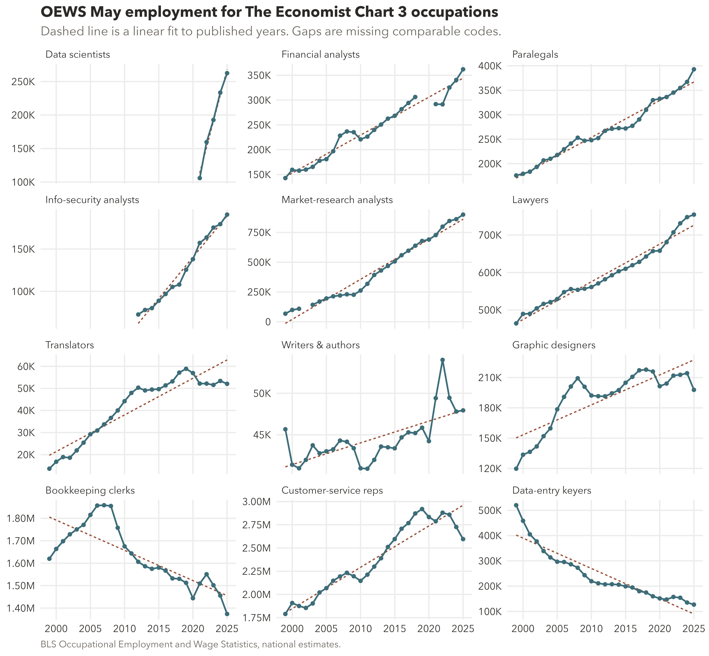
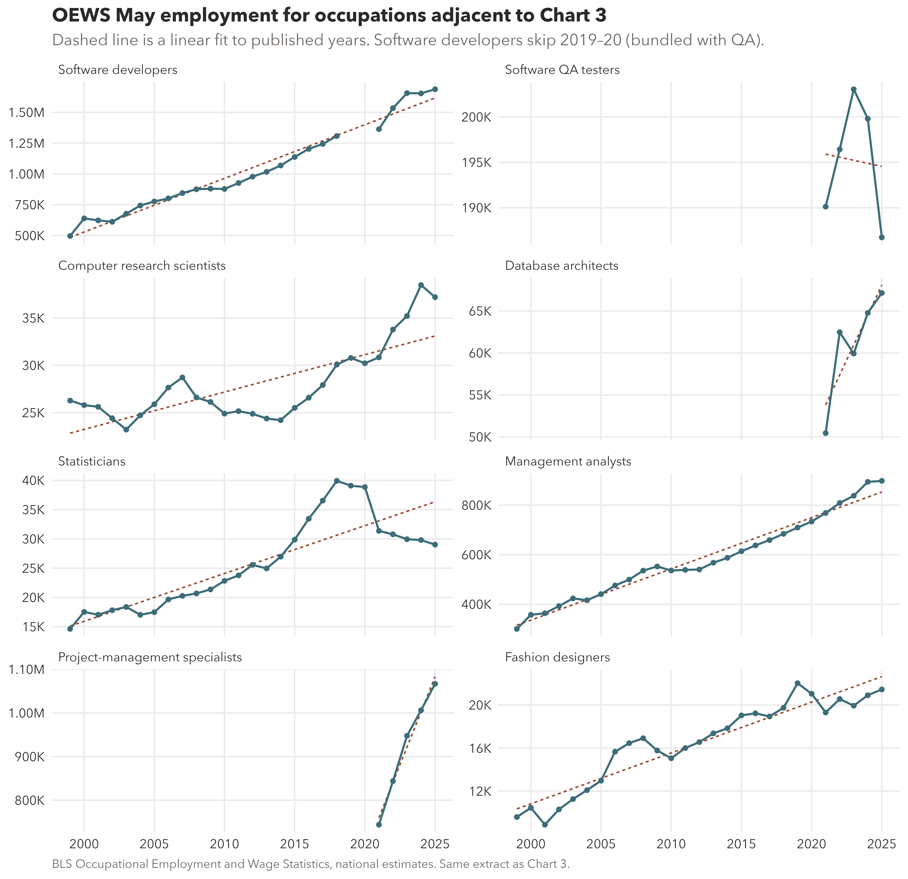

#+TITLE: US employment in The Economist's Chart 3 occupations
#+OPTIONS: toc:2 num:nil
#+STARTUP: overview indent inlineimages
#+PROPERTY: header-args:R :session *oews* :results output replace :exports both :tangle data_scientist_employment.R
#+PROPERTY: header-args:sh :tangle rebuild-oews.sh :shebang "#!/bin/sh"

*The Economist*'s [[https://www.economist.com/finance-and-economics/2026/09/04/the-jobs-apocalypse-is-postponed-an-ai-jobs-boom-is-here][4 September 2026]] Chart 3 uses May OEWS establishment
employment. This notebook drops the CPS series and plots every May
national estimate that BLS published for those occupations.

Open the buffer in Emacs with ~R~ enabled for Babel and evaluate the
blocks in order. Figures go to ~plots/~.

Rebuild the CSV from the cached HTML (no network) with:

#+begin_src sh :results silent
python3 fetch_oews.py
#+end_src

* Occupations and classification breaks

| Occupation               | Current SOC | First year here | Notes |
|--------------------------+-------------+-----------------+-------|
| Data scientists          | 15-2051     | 2021            | First standalone OEWS year |
| Financial analysts       | 13-2051     | 1999            | 2018 SOC rename; 2019–20 unpublished as a detail |
| Paralegals               | 23-2011     | 1999            | |
| Info-security analysts   | 15-1212     | 2012            | 15-1122 through 2018 |
| Market-research analysts | 13-1161     | 1999            | 19-3021 through 2011 (includes survey researchers) |
| Lawyers                  | 23-1011     | 1999            | |
| Translators              | 27-3091     | 1999            | |
| Writers & authors        | 27-3043     | 1999            | |
| Graphic designers        | 27-1024     | 1999            | |
| Bookkeeping clerks       | 43-3031     | 1999            | |
| Customer-service reps    | 43-4051     | 1999            | |
| Data-entry keyers        | 43-9021     | 1999            | |

2002 market-research employment is missing (the Wayback copy of that
major-group table was offline). 2019–2020 financial-analyst employment
was published only as the hybrid 13-2098 bundle and is left blank.

* Occupation definitions

Official texts for every occupation plotted here are in the
[[https://www.bls.gov/soc/2018/soc_2018_definitions.pdf][2018 SOC Definitions]].

Employment numbers are May OEWS national estimates, parsed from BLS
HTML (Wayback copies under ~cache/~). Each CSV row keeps its
~source_url~.

* Setup

#+begin_src R
library(dplyr)
library(readr)
library(ggplot2)
library(scales)
library(tidyr)

notebook_dir <- {
  csv <- "oews_occupations.csv"
  ofile <- Filter(Negate(is.null), lapply(sys.frames(), `[[`, "ofile"))
  candidates <- c(
    getwd(),
    file.path(getwd(), "notebooks", "data_scientist_employment"),
    if (length(ofile)) dirname(ofile[[1]])
  )
  found <- candidates[file.exists(file.path(candidates, csv))]
  if (!length(found)) {
    stop("Cannot find oews_occupations.csv from ", getwd())
  }
  normalizePath(found[[1]])
}
setwd(notebook_dir)
dir.create("plots", showWarnings = FALSE)

occupations <- c(
  "Data scientists",
  "Financial analysts",
  "Paralegals",
  "Info-security analysts",
  "Market-research analysts",
  "Lawyers",
  "Translators",
  "Writers & authors",
  "Graphic designers",
  "Bookkeeping clerks",
  "Customer-service reps",
  "Data-entry keyers"
)

oews <- read_csv("oews_occupations.csv", show_col_types = FALSE) |>
  filter(occupation %in% occupations) |>
  mutate(occupation = factor(occupation, levels = occupations))

# Insert NA years so ggplot does not draw a line across classification gaps.
oews_plot <- oews |>
  complete(occupation, year = min(year):max(year))

ink <- "#2C2A28"
teal <- "#3E6D7A"
muted <- "#6B6560"
rust <- "#9B4D35"

theme_note <- function() {
  theme_minimal(base_family = "Avenir Next", base_size = 12) +
    theme(
      plot.title = element_text(face = "bold", colour = ink, hjust = 0),
      plot.subtitle = element_text(colour = muted, hjust = 0),
      plot.caption = element_text(colour = muted, hjust = 0, size = 9),
      panel.grid.minor = element_blank(),
      strip.text = element_text(hjust = 0, colour = ink),
      axis.text = element_text(colour = ink),
      axis.title = element_text(colour = ink)
    )
}

oews
#+end_src

#+RESULTS:
#+begin_example

indexing oews_occupations.csv [==========================================================================================================] 4.13GB/s, eta:  0s
                                                                                                                                                                                                
# A tibble: 286 × 8
    year month occupation         soc     soc_in_release title_in_release                                 employment source_url
   <dbl> <dbl> <fct>              <chr>   <chr>          <chr>                                                 <dbl> <chr>
 1  1999     5 Bookkeeping clerks 43-3031 43-3031        Bookkeeping, Accounting, and Auditing Clerks (3)    1619870 https://web.archive.org/web/20020804075…
 2  2000     5 Bookkeeping clerks 43-3031 43-3031        Bookkeeping, Accounting, and Auditing Clerks        1663530 https://web.archive.org/web/20020803075…
 3  2001     5 Bookkeeping clerks 43-3031 43-3031        Bookkeeping, Accounting, and Auditing Clerks        1697890 https://web.archive.org/web/20051210174…
 4  2002     5 Bookkeeping clerks 43-3031 43-3031        Bookkeeping, Accounting, and Auditing Clerks        1728730 https://web.archive.org/web/20060207064…
 5  2003     5 Bookkeeping clerks 43-3031 43-3031        Bookkeeping, Accounting, and Auditing Clerks        1750680 https://web.archive.org/web/20040629025…
 6  2004     5 Bookkeeping clerks 43-3031 43-3031        Bookkeeping, Accounting, and Auditing Clerks        1770860 https://web.archive.org/web/20060829172…
 7  2005     5 Bookkeeping clerks 43-3031 43-3031        Bookkeeping, Accounting, and Auditing Clerks        1815340 https://web.archive.org/web/20070702195…
 8  2006     5 Bookkeeping clerks 43-3031 43-3031        Bookkeeping, Accounting, and Auditing Clerks        1856890 https://web.archive.org/web/20111018102…
 9  2007     5 Bookkeeping clerks 43-3031 43-3031        Bookkeeping, Accounting, and Auditing Clerks        1858500 https://web.archive.org/web/20120419010…
10  2008     5 Bookkeeping clerks 43-3031 43-3031        Bookkeeping, Accounting, and Auditing Clerks        1855010 https://web.archive.org/web/20111017040…
# ℹ 276 more rows
# ℹ Use `print(n = ...)` to see more rows
#+end_example
* May 2023 to May 2025

#+begin_src R
change <- oews |>
  filter(year %in% c(2023, 2025)) |>
  select(occupation, year, employment) |>
  pivot_wider(names_from = year, values_from = employment, names_prefix = "y") |>
  mutate(change_pct = 100 * (y2025 / y2023 - 1)) |>
  arrange(desc(change_pct))

change
#+end_src

#+RESULTS:
#+begin_example
# A tibble: 12 × 4
   occupation                 y2023   y2025 change_pct
   <fct>                      <dbl>   <dbl>      <dbl>
 1 Data scientists           192710  262440     36.2
 2 Financial analysts        325220  361980     11.3
 3 Paralegals                354890  392880     10.7
 4 Info-security analysts    175350  190650      8.73
 5 Market-research analysts  846370  899580      6.29
 6 Lawyers                   731340  754500      3.17
 7 Translators                51560   52060      0.970
 8 Writers & authors          49450   47940     -3.05
 9 Graphic designers         212720  197830     -7.00
10 Bookkeeping clerks       1501910 1373680     -8.54
11 Customer-service reps    2858710 2595750     -9.20
12 Data-entry keyers         154230  127080    -17.6
#+end_example
* Data scientists

#+begin_src R :results file link :file (expand-file-name "plots/data_scientists.png" (file-name-directory (buffer-file-name)))
ds <- oews |> filter(occupation == "Data scientists")
y2023 <- ds$employment[ds$year == 2023]
y2025 <- ds$employment[ds$year == 2025]

p_ds <- ggplot(ds, aes(year, employment)) +
  geom_line(colour = teal, linewidth = 0.9) +
  geom_point(colour = teal, size = 2.2) +
  scale_x_continuous(breaks = ds$year) +
  scale_y_continuous(labels = label_number(scale_cut = cut_short_scale()),
                     limits = c(0, NA)) +
  labs(
    title = sprintf(
      "OEWS data-scientist jobs rose %.0f%% from May 2023 to May 2025",
      100 * (y2025 / y2023 - 1)
    ),
    subtitle = "SOC 15-2051, national May estimates. First published as a standalone occupation in 2021.",
    x = NULL,
    y = "Employment",
    caption = "BLS Occupational Employment and Wage Statistics."
  ) +
  theme_note()
ggsave(file.path(notebook_dir, "plots", "data_scientists.png"), p_ds,
       width = 9.2, height = 5.2, dpi = 150)
#+end_src

#+RESULTS:

* Chart 3 occupations

Free y-scales, because customer-service employment is an order of
magnitude larger than translators.

#+begin_src R :results file link :file (expand-file-name "plots/facet.png" (file-name-directory (buffer-file-name)))
p_facet <- ggplot(oews_plot, aes(year, employment)) +
  geom_smooth(method = "lm", formula = y ~ x, se = FALSE, colour = rust,
              linewidth = 0.55, linetype = "22", na.rm = TRUE) +
  geom_line(colour = teal, linewidth = 0.75) +
  geom_point(colour = teal, size = 1.3, na.rm = TRUE) +
  facet_wrap(~occupation, scales = "free_y", ncol = 3) +
  scale_x_continuous(breaks = c(2000, 2005, 2010, 2015, 2020, 2025)) +
  scale_y_continuous(labels = label_number(scale_cut = cut_short_scale())) +
  labs(
    title = "OEWS May employment for The Economist Chart 3 occupations",
    subtitle = "Dashed line is a linear fit to published years. Gaps are missing comparable codes.",
    x = NULL,
    y = NULL,
    caption = "BLS Occupational Employment and Wage Statistics, national estimates."
  ) +
  theme_note()
ggsave(file.path(notebook_dir, "plots", "facet.png"), p_facet,
       width = 9.5, height = 8.8, dpi = 600, bg = "white",
       device = ragg::agg_png)
#+end_src

#+RESULTS:

* 2023–2025 change

The comparison *The Economist* cites for paralegals and market-research
analysts.

#+begin_src R :results file link :file (expand-file-name "plots/change_2023_2025.png" (file-name-directory (buffer-file-name)))
p_change <- change |>
  mutate(occupation = factor(occupation, levels = rev(occupation))) |>
  ggplot(aes(change_pct, occupation, fill = change_pct > 0)) +
  geom_col(width = 0.72) +
  geom_vline(xintercept = 0, colour = ink, linewidth = 0.35) +
  scale_fill_manual(values = c("#B85C4A", teal), guide = "none") +
  scale_x_continuous(labels = label_number(suffix = "%")) +
  labs(
    title = "May 2023 to May 2025: data scientists are the outlier",
    subtitle = "Paralegals +11% and market-research analysts +6%, as in Chart 3.",
    x = "Change in OEWS employment",
    y = NULL,
    caption = "BLS OEWS national May estimates. US employment rose about 2.5% over the same window."
  ) +
  theme_note()
ggsave(file.path(notebook_dir, "plots", "change_2023_2025.png"), p_change,
       width = 9.2, height = 5.6, dpi = 150)
#+end_src

* Why these occupations, and what sits next to them

Chart 3 is not a neighbourhood of data scientists. In
[[https://www.economist.com/finance-and-economics/2026/09/04/the-jobs-apocalypse-is-postponed-an-ai-jobs-boom-is-here][the 4 September 2026 article]]
it is the set of white-collar occupations “once believed to be most
vulnerable to AI”. The piece highlights paralegals (+11%) and
market-research analysts (+6%) against a national rise of about 2.5%,
and customer-service workers (about −10%) and secretaries and
administrative assistants (about −15%) as the routine-task losers.
Data scientists sit on the same chart as the AI-boom contrast; Chart 2
in the article is the broader computer/math cluster (engineers,
software developers, mathematicians, data scientists).

That selection is a story about supposedly AI-exposed work, not a
claim that 15-2051 is the right box for machine-learning engineers.
The occupations below are the nearest published SOC details to the
titles that question raises. Same May OEWS extract as Chart 3
(~oews_occupations.csv~, ~source_url~ on every row).

| Occupation                     | Current SOC | Proxy for                         | First year here | Notes |
|--------------------------------+-------------+-----------------------------------+-----------------+-------|
| Software developers            | 15-1252     | Software / ML / AI engineers      | 1999            | Sum of applications + systems-software details through 2018 |
| Software QA testers            | 15-1253     | QA engineer in software           | 2021            | New 2018-SOC detail; 2019–20 bundled with developers as 15-1256 |
| Computer research scientists   | 15-1221     | AI research                       | 1999            | 15-1011 through 2009; 15-1111 through 2018 |
| Database architects            | 15-1243     | Data engineers (warehouse/pipeline) | 2021          | 2019–20 unpublished as a detail (hybrid 15-1245 with DBAs) |
| Statisticians                  | 15-2041     | Explicit exclusion from 15-2051   | 1999            | |
| Management analysts            | 13-1111     | Product / business / program analysts | 1999        | Includes program analysts; not a “product analyst” occupation |
| Project-management specialists | 13-1082     | Product owners                    | 2021            | No SOC occupation named product owner; 2019–20 hybrid 13-1198 |
| Fashion designers              | 27-1022     | Creative neighbour of graphic designers | 1999      | |

2019–2020 software-developer employment was published only as the
hybrid 15-1256 bundle with QA testers and is left blank, matching the
financial-analyst treatment on Chart 3.

* Adjacent occupations

Free y-scales. Software-developer employment is two orders of
magnitude larger than fashion designers or statisticians.

#+begin_src R
adjacent <- c(
  "Software developers",
  "Software QA testers",
  "Computer research scientists",
  "Database architects",
  "Statisticians",
  "Management analysts",
  "Project-management specialists",
  "Fashion designers"
)

oews_adj <- read_csv("oews_occupations.csv", show_col_types = FALSE) |>
  filter(occupation %in% adjacent) |>
  mutate(occupation = factor(occupation, levels = adjacent))

oews_adj_plot <- oews_adj |>
  complete(occupation, year = min(year):max(year))

change_adj <- oews_adj |>
  filter(year %in% c(2023, 2025)) |>
  select(occupation, year, employment) |>
  pivot_wider(names_from = year, values_from = employment, names_prefix = "y") |>
  mutate(change_pct = 100 * (y2025 / y2023 - 1)) |>
  arrange(desc(change_pct))

change_adj
#+end_src

#+RESULTS:
#+begin_example
# A tibble: 8 × 4
  occupation                       y2023   y2025 change_pct
  <fct>                            <dbl>   <dbl>      <dbl>
1 Project-management specialists  947630 1066670      12.6
2 Database architects              59920   67140      12.0
3 Fashion designers                19940   21450       7.57
4 Management analysts             838140  898280       7.18
5 Computer research scientists     35210   37200       5.65
6 Software developers            1656880 1687890       1.87
7 Statisticians                    29950   29030      -3.07
8 Software QA testers             203040  186740      -8.03
#+end_example

Software developers, the box that usually holds ML and AI engineers, rose 1.9%
over the Chart 3 window — in line with national employment, not with data
scientists (+36%). Software QA testers fell 8%. Fashion designers rose 8%
while graphic designers on Chart 3 fell 7%.

#+begin_src R :results file link :file (expand-file-name "plots/facet_adjacent.png" (file-name-directory (buffer-file-name)))
p_adj <- ggplot(oews_adj_plot, aes(year, employment)) +
  geom_smooth(method = "lm", formula = y ~ x, se = FALSE, colour = rust,
              linewidth = 0.55, linetype = "22", na.rm = TRUE) +
  geom_line(colour = teal, linewidth = 0.75) +
  geom_point(colour = teal, size = 1.3, na.rm = TRUE) +
  facet_wrap(~occupation, scales = "free_y", ncol = 2) +
  scale_x_continuous(breaks = c(2000, 2005, 2010, 2015, 2020, 2025)) +
  scale_y_continuous(labels = label_number(scale_cut = cut_short_scale())) +
  labs(
    title = "OEWS May employment for occupations adjacent to Chart 3",
    subtitle = "Dashed line is a linear fit to published years. Software developers skip 2019–20 (bundled with QA).",
    x = NULL,
    y = NULL,
    caption = "BLS Occupational Employment and Wage Statistics, national estimates. Same extract as Chart 3."
  ) +
  theme_note()
ggsave(file.path(notebook_dir, "plots", "facet_adjacent.png"), p_adj,
       width = 9.5, height = 9.2, dpi = 600, bg = "white",
       device = ragg::agg_png)
#+end_src

#+RESULTS:

